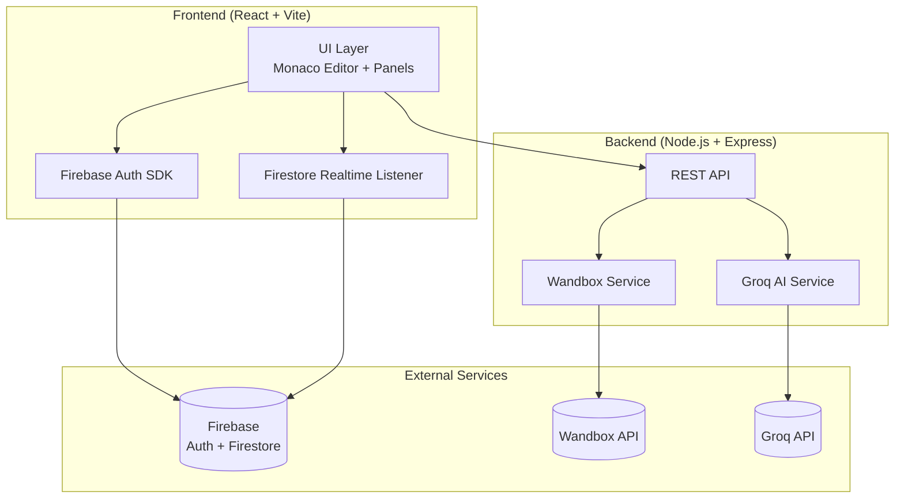

# System Architecture — Debugra

## High-Level Architecture



## Data Flow

```
1. USER ACTION          → React UI captures event
2. CODE SYNC            → Firestore realtime write (debounced 300ms)
3. CODE EXECUTION       → POST /api/execute → Wandbox → returns stdout/stderr
4. AI FEATURES          → POST /api/ai/{action} → Groq → returns AI response
5. CHAT                 → Firestore collection write → realtime broadcast
```

> [!IMPORTANT]
> **Key Design Decision:** Firebase handles ALL realtime sync (code state, chat, presence). The Express backend ONLY handles Wandbox execution and Groq AI calls. This keeps the architecture simple and hackathon-friendly.

---

## Folder Structure

```
debugra/
├── docs/                      # Project documentation
│   ├── PRD.md
│   └── architecture.md
├── public/
│   └── favicon.svg
├── server/                    # Express backend
│   ├── middleware/
│   │   └── errorHandler.js
│   ├── routes/
│   │   ├── ai.js              # Groq AI endpoints
│   │   └── execute.js         # Wandbox proxy
│   ├── services/
│   │   ├── groqService.js
│   │   └── judge0Service.js   # Wandbox execution service
│   ├── server.js
│   ├── Dockerfile
│   └── package.json
├── src/                       # React frontend (Vite)
│   ├── config/
│   │   └── constants.js       # Global config tokens
│   ├── hooks/
│   │   ├── index.js           # Barrel export
│   │   ├── useAI.js           # AI feature logic
│   │   ├── useEditor.js       # Editor state/stdin
│   │   ├── useExecution.js    # Code execution logic
│   │   ├── useIsMobile.js     # Breakpoint detection
│   │   └── useRoom.js         # Firestore room sync
│   ├── components/
│   │   ├── Auth/
│   │   │   └── AuthModal.jsx
│   │   ├── Chat/
│   │   │   └── ChatPanel.jsx
│   │   ├── Editor/
│   │   │   ├── EditorPage.jsx         # Main orchestrator
│   │   │   ├── AIResponsePanel.jsx    # AI response display
│   │   │   ├── CollaborationControls.jsx
│   │   │   ├── EditorStatusBar.jsx
│   │   │   ├── HistoryPanel.jsx
│   │   │   └── MobileBottomNav.jsx
│   │   └── Landing/
│   │       ├── LandingPage.jsx
│   │       └── LandingPage.css
│   ├── services/
│   │   ├── api.js             # Axios instance + interceptors
│   │   └── firebase.js        # Firebase init
│   ├── utils/
│   │   ├── languageConfig.js  # Language → compiler mapping
│   │   ├── problemsData.js    # Practice problems
│   │   └── snippetsConfig.js  # Default code snippets
│   ├── App.jsx                # Router + auth listener
│   ├── main.jsx               # Entry point
│   └── index.css              # Global styles
├── .env.example
├── .gitignore
├── index.html
├── package.json
├── README.md
├── tsconfig.json
├── vercel.json
└── vite.config.js
```

---

## Firebase Schema

```javascript
// 1. users/{userId}
{
  uid: "string",
  displayName: "string",
  email: "string",
  photoURL: "string",
  createdAt: Timestamp
}

// 2. rooms/{roomId}
{
  name: "string",
  createdBy: "userId",
  language: "python",
  code: "string",
  problem: {
    title: "string",
    description: "string",
    examples: ["string"],
    constraints: ["string"]
  },
  activeUsers: ["userId"],
  createdAt: Timestamp,
  updatedAt: Timestamp
}

// 3. rooms/{roomId}/messages/{messageId}
{
  userId: "string",
  displayName: "string",
  text: "string",
  type: "chat" | "inline",
  lineNumber: number | null,
  createdAt: Timestamp
}

// 4. rooms/{roomId}/presence/{userId}
{
  displayName: "string",
  cursor: { lineNumber: number, column: number },
  isTyping: boolean,
  color: "string",
  lastSeen: Timestamp
}
```

---

## Deployment

| Service | Platform | Config |
|---------|----------|--------|
| Frontend | Vercel | `npm run build` → Deploy `dist/` |
| Backend | Cloud Run | `cd server && docker build` |
| Firebase | Google Cloud | Auto-managed |

### Environment Variables

**Frontend (.env)**
```
VITE_FIREBASE_API_KEY=
VITE_FIREBASE_AUTH_DOMAIN=
VITE_FIREBASE_PROJECT_ID=
VITE_FIREBASE_MESSAGING_SENDER_ID=
VITE_FIREBASE_APP_ID=
VITE_API_URL=http://localhost:3001
```

**Backend (server/.env)**
```
GROQ_API_KEY=
PORT=3001
CLIENT_URL=http://localhost:5173
CORS_ORIGINS=http://localhost:5173,http://127.0.0.1:5173
```
